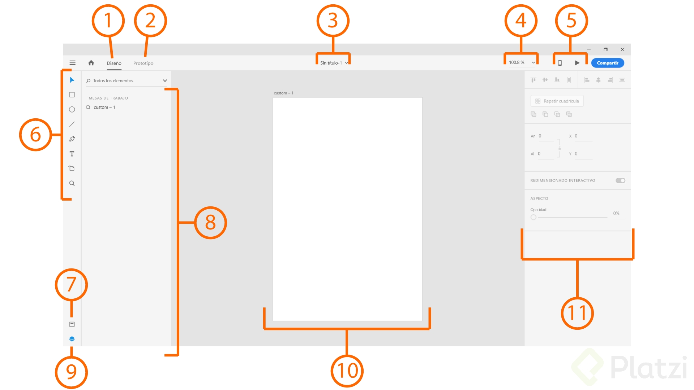
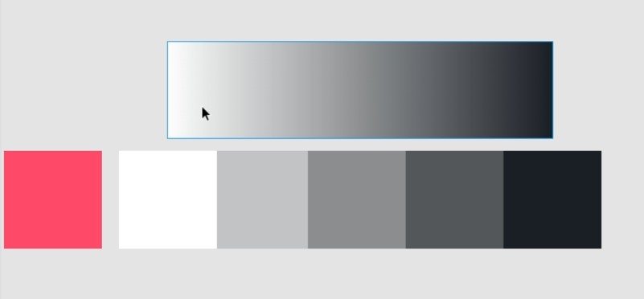

# AdobeXD
Curso de Adobe XD

#### Profe Carlos Jiménez

## Qué es XD 
eXperence Desing es gratuito y la apuesta ede XD por el diseño de interfaces. 

Se puede descargar de forma gratuita por medio de la página oficial y con una cuenta de Adobe (también gratuita).

## Creación de un documento
Portada, el Home, archivos que aplifican las funciones de XD
Archivos en la nuve, compartidos con nosotros. 
En el Home estan los accesos directos a lo creado ultimante por medio de orden cronologico y en la esquina derecha hay un tutorial 
En el centro estan los Artboard, (documentos base) teléfonos, tablets, web y personalizado

## Interfaz y navegación
1. Modo de diseño: encontramos las herramientas para crear, las capas artboards, panel de herramientas y propiedades
2. Modo prototipo: selecionar los objetos del diseño y "cablearlos" para crear interación 
3. Nombre del Proyecto
4. Zoom para ajustar el viewport 
5. vista previa (de movil y de ordenador)
6. barra de herramientas, las herramientas de trabajo
7. activos, seccion de paleta de colores, caracteres, rellenos, etc 
8. capas, cuando selecionamos el artboard veremos las capas contenidas (elementos creados)
9. mostrar u ocultar capas
10. artboard o mesa de trabajo 

### En Widows para moverse 
- barra espaciadora y click sirva para mostrar la mano y mover el artboard
- el zoom esta en la esquina y al final de la barra de herramientas 
- con z tambien cambia para tener zoom in
- con alt cambia el zoom para zoom out

## Artboard 
- tiene un "preset" en el tamanio pero se puede personalizar 
- tiene un "limite de alto" pero se puede "alargar" y se conserva una linea punteada.
- se puede aplicar un color 

## grid y layout 
- Selecionando Layout tenemos: 
- se ajusta automaticamente, hay diferentes cantidades de columnas pero se puede perzonalizar
- se pueden agregar margenes del grid 
- se puede usar los por defecto o crear alguno por defecto 
- Selecionando Square tenemos: 
- podemos personalizar el tamanio de los gruados o grid 

## Formas 
- dando click en la esquina superior izquierda encontramos las formas podemos cambiar la dimensiones orientacion en X o Y
- opacidad 
- bordes redondeados / iguales o bien separados
- relleno y borde el cuenta gotas es muy util RGB, Hex, HBS.
- Ademas podemos escoger si los bordes crecen hacia adentro, afuera o bien centrado (dentro y fuera)
- se pueden ajustar los bordes de las esquinas, recto, rectangular y redondeado sin modificar la forma 
- sombra o shadow en X y X y blur o desvanecido entre mas alto mas difuminado
- comparten todo la unica diferencia es que el circulo no tiene bordes redondeados y el tringulo puede crear poligonos  (el triangulo si acepota bordes redondeados)
- la linea comparte y agrega terminaciones a las lineas 

## Alinear y combiar formas
- para ducplicar formas es ctrl + d o bien alt y arrastar la forma 
- cuando tenemos mas de un objeto nos muestra las guias dinamicas 
- al seleccionar mas de un elemento puedo alinear los objetos verticar y horizontalmente
- al tener mas de un objeto tenemos opciones de combinacion (fusionar) de formas. Combiar, sustraer, interseccion, elimina la interseccion.
- cuando tenemos una imagen de fondo y trabajar sobre ella damos click derecho y lock, ctrl + l de esa forma podemos crear formas sobre ella. 
- cuando queremos alinear un objeto dentro del otro seleccionamos ambos y selecionamos la alineacion 
- para crear formas simples de formas complejas se seleccionan ctrl + 8

## Textos y tipografias 
- En el panel de herramientas hay una T 
- hay dos formas de crear texto 
- solo click y crea el cursor parpadeante y es el texto de punto (ajustado al contenido)
- la segunda es click y crear una "ventana" o area de texto, texto de area es lo mismo,  el texto se adapta al area que definimos
- tenemos upercase, lowercase, capitalcase, subrayyado y tachado 
- lo mas aficiente es traer los textos ya hechos. Adobe XD permite importar txt, con arrastrarlo lo trae tipo area

## imagenes y mascaras
- se puede solo arrastrar y soltar 
- jpg y png son los mas faciles y comunes pero no los unicos que se pueden usar 
- alto, ancho, opacidad, relleno
- las esquinas tienen circulos para redondear bordes, como si fueran formas, algunas propiedades son compartidas
- podemos insertar la imgen dentro de una forma (cuadro, tringualo, circulo, rectangulo)
- se puede redimensionar junto con el contenedor 
- se inserta imagen se "dibuja la forma" y en objeto se puede crear un mascara como en otros programas de Adobe, la ventaja es tener las dos formas independientes

## Pluma
- la pluma esta en el panel de herramientas debajo de la linea 
- se crean nodos y como en todo adobe punto es nodo
- se pueden cerrar o no las formas se suelta con "esc" la forma
- al dar doble clic sobre las linea se puede agregar y cambiar los nodos
- para crear curvas se crean dos puntos (nodos) arrastrando, y el punto decide donde se creara la curva

## Repeat grid tool
- con el grid layout a 12 columnas (idealmente para diseño y desarrollo) se podrían crear cuadros de 4 columnas
- se aplica el formato al cuadro (forma que usaremos de base)
- cuando tenemos un objeto sobre otro y queremos ubicarlo a cierto margen del contenedor presionamos alt y me dice de forma inteligente la distancia del contenido en los cuatro puntos del contenedor
- con la unidad minima de repetición selecionada presionamos grid tool y nos mostrará controladores laterales e inferior
- se pueden ajustar los margenes del grid entre columnas con el indicador magenta

## Carga de contenidos en grid repeat tool 
- se seleccionan las imagenes y se colocan sobre uno de los elementos del grid y automaticamente colocará las imagenes y si luego aumentamos el tamaño del grid autorellenara 
- pasa lo mismo con los textos, idealmente en un txt con un salto de linea entre ellos
- se selecciona y arrastra sobre alguno de los elementos y los colocara automaticamente

## Componentes
- los componentes son elementos reusables a travez de un diseño 
- se diseña el objeto base (un botón por ejemplo)
- hecho el botón lo seleccionamos, damos clic derecho y selecionamos la opcion hacerlo componente
- si llegaramos a borrar el padre por error click derecho en cualquiera y editar el componente maestro
- se puede replicar muchas veces que al momento de editar el componente padre (el original) y todos aplicarán el cambio 
- qué si hay variaciones? los hijos se pueden editar de forma independiente, dando doble clic lo podemos ver como si fuera un grupo sigue heredando propiedades, todas las propiedades no modificadas son heredadas 

## panel de assets
- todo los reutilizable, estilos de fuentes, colores, fondos, degradados. 
- arribla del icono de las capas estará el de assets ahi se guardan los componentes, ahi mismo estan los colores y estilos de caracteres
- selecionado el estilo grado y se presiona sobre el signo + 
- ahora con nuevos textos, con los mismos selecionados se da click sobre el estilo que se quiere agregar 
- funciona igual con los colores idealmente crearlos con formas basicas rellenas para ver la progresión del color 
- los assets pueden ser compartidos siempre que se tenga creative cloud

## resposive resize
- Se puede hacer el contenedor y el contenido ajustable
- se puede hacer el contido no ajustable
- se puede establecer manual y el alto y ancho fijo
- se puede establecer manual y la ubicacion del contenido al hacer responsive
- se puede seleccionar para el grid repeat como para el contenedor 

## UI Kit
- user interafaces kit 
- es crear sobre elementos exitentes
- Android y IOS tienen su propios elementos. 
- desde el menu Get UIKits

## Creando una App
- wireframe es un diseno a mano
- wireframe tambien puede ser el disenio en XD con pocos detalles, no colores, no iconos, solo formas
- se pueden renombrar los artboard doble click o clicle derecho en el los assets y rename
- mockups son los disenios con mas detalles
- para duplicar artboard clic sobre el nombre alt click y arrastro 

## Mockup 
- ya tiene formas y colores, iconos e imagenes. 
- las guias se muestran cuando nos ubicamos sobre los bordes mostrando una gris mas claro y arrastrando creamos guias
- aqui se decide la tipografia porque cambia los tamanios
- los margenes y tipografias pueden ser multiplos de 8 para generar consistencia

## Definiendo la paleta de colores
- creando formas simples - cuadrados -  definimos el color principal - destacado, interactivo, acciones
- necesitaremos 4 o 5 tonos de gris 
- se define el color mas claro (blanco)
- se define el color mas oscuro (no es buena idea que sea totalmente negro) un gris oscuro tendiendo a azul 
- se definen 3 0 4 entre el blanco y el gris oscuro 
- se hace una rectangulo sobre ambos cuadro para hacer un degradado y de esa forma se pueden sacar los colores 
- luego se debieran agregar a los assets
